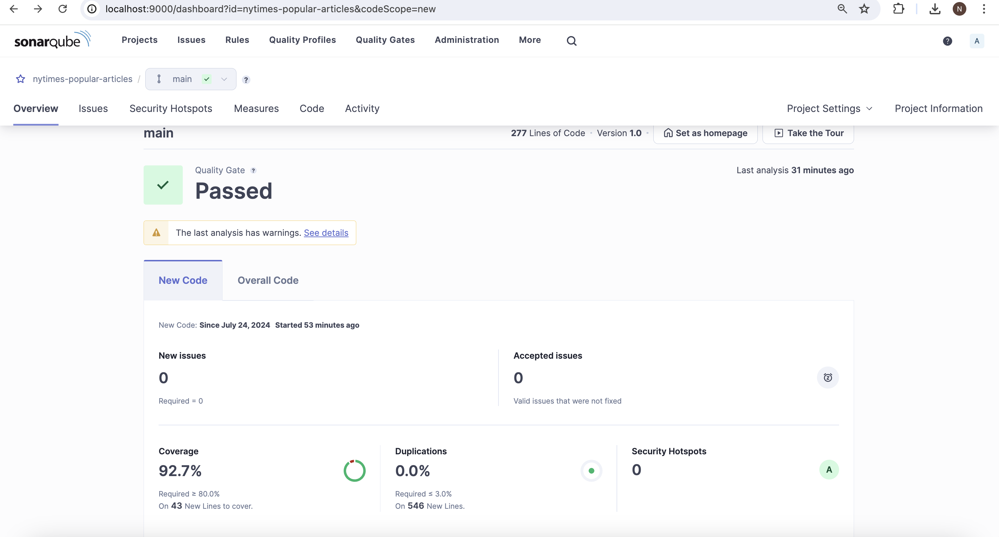
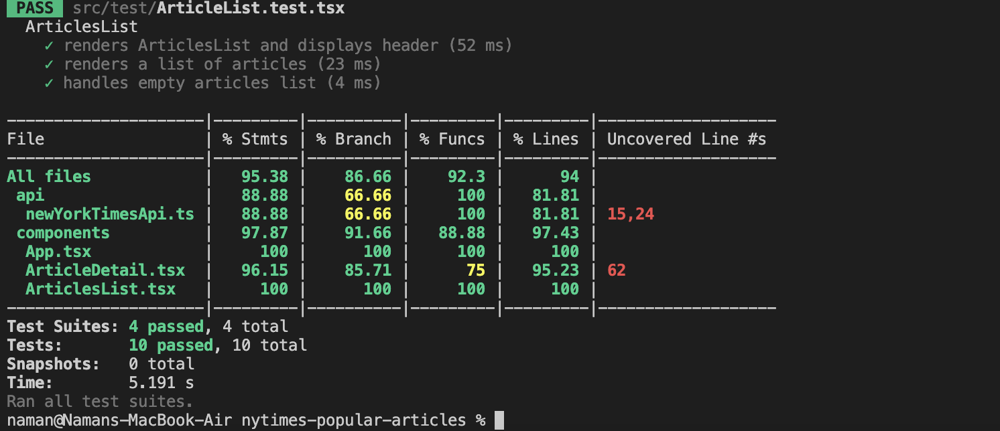

# NY Times Popular Articles

This project is a simple web application that fetches and displays the most popular articles from the NY Times API. Built using React and TypeScript, it features a master/detail view where users can see a list of articles and view detailed information about each article. The project also includes testing and build scripts to ensure code quality and maintainability.

## Features

- Fetch and display the most popular articles from the NY Times API.
- Show article details in a separate view when an article is selected.
- Responsive design with a clean UI.
- Unit tests and UI tests using Jest and React Testing Library.
- Static code analysis with ESLint and Prettier.
- Code coverage reports.
- Integration with SonarQube for code quality analysis.

## Getting Started

### Prerequisites

- Node.js (v18 or higher recommended)
- npm or yarn

### Installation

1. Clone the repository:

   ```bash
   git clone https://github.com/N-Joshi/nytimes-popular-articles.git
   ```

2. Navigate to the project directory:

   ```bash
   cd nytimes-popular-articles
   ```

3. Install the dependencies:

   ```bash
   npm install
   ```

### Configuration

1. Obtain an API key from NY Times:

   - Sign up for an API key at [NY Times Developer](https://developer.nytimes.com/get-started).
   - Replace `YOUR_API_KEY` in `src/api.ts` with your actual API key.

### Running the Application

1. Start the development server:

   ```bash
   npm start
   ```

   The application will be available at `http://localhost:3000`.

### Building the Project

1. Build the project for production:

   ```bash
   npm run build
   ```

   The build output will be located in the `build` directory.

### Running Tests

1. Run unit tests:

   ```bash
   npm test
   ```

2. Run tests with code coverage:

   ```bash
   npm run coverage
   ```

### Static Code Analysis

1. Run ESLint:

   ```bash
   npm run lint
   ```

2. Format code with Prettier:

   ```bash
   npm run format
   ```

### SonarQube Integration

1. Install SonarQube Scanner globally:

   ```bash
   npm install -g sonar-scanner
   ```

2. Configure SonarQube settings in `sonar-project.properties`:

   ```properties
        sonar.projectKey=nytimes-popular-articles
        sonar.projectName=nytimes-popular-articles
        sonar.projectVersion=1.0
        sonar.sources=src
        sonar.tests=src
        sonar.test.inclusions=**/*.test.tsx,**/*.test.ts
        sonar.javascript.lcov.reportPaths=coverage/lcov.info
        sonar.host.url=http://localhost:9000
        sonar.token=
   ```

3. Run SonarQube analysis:

   ```bash
   npm sonar
   ```

### Project Structure

- `src/`
  - `components/` - React components for the application.
  - `pages/` - React pages including `ArticleList` and `ArticleDetail`.
  - `api/` - API call functions.
  - `App.tsx` - Main application component.
  - `index.tsx` - Entry point of the application.
- `public/` - Static assets.
- `tests/` - Test files.
- `sonar-project.properties` - SonarQube configuration file.


### License

This project is licensed under the MIT License. See the [LICENSE](LICENSE) file for details.

### Snapshots of Code Coverage and Sonar Qube Integration Run






